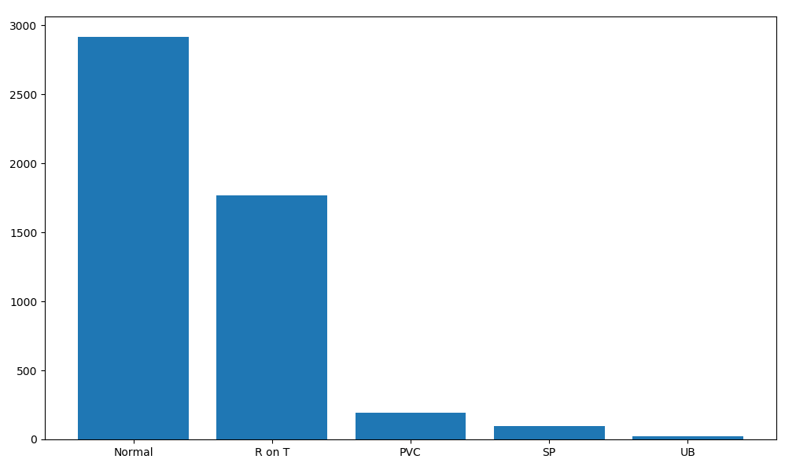

# Anomaly-detection-using-LSTM-autoencoders

**Tools and Technology used:** Python, NumPy, PyTorch, Matplotlib, Seaborn

Implemented an LSTM Autoencoders for Time Series anomaly detection to classify a heartbeat into normal or anomaly.

**Data:** The dataset contains 5,000 Time Series examples (obtained with ECG) with 140 timesteps. Each sequence corresponds to a single heartbeat from a single patient with congestive heart failure. [Source](http://timeseriesclassification.com/description.php?Dataset=ECG5000)

## Plots and Results

1. Distribution of classes in the data

2. Averaged (smoothed out) time series for each class

3. Density plot of reconstruction loss for training data

4. Density plot of reconstruction loss for test data of normal heartbeats 

5. Density plot for reconstruction loss for test data of anomaly heartbeats

